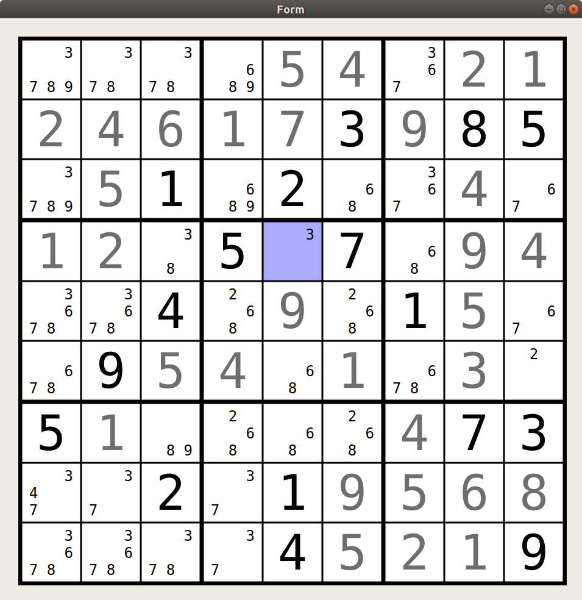

# Sudoku GUI
This is a skeleton sudoku GUI in PyQt5. It contains no game logic and is also missing some GUI logic. Can display clues (black), user entries (grey) and "pencil marks" (small numbers) and focus a cell.

Numbers are entered by number keys 1-9, pencil marks by F1-F9. Numbers can be switched between black/grey via space.

