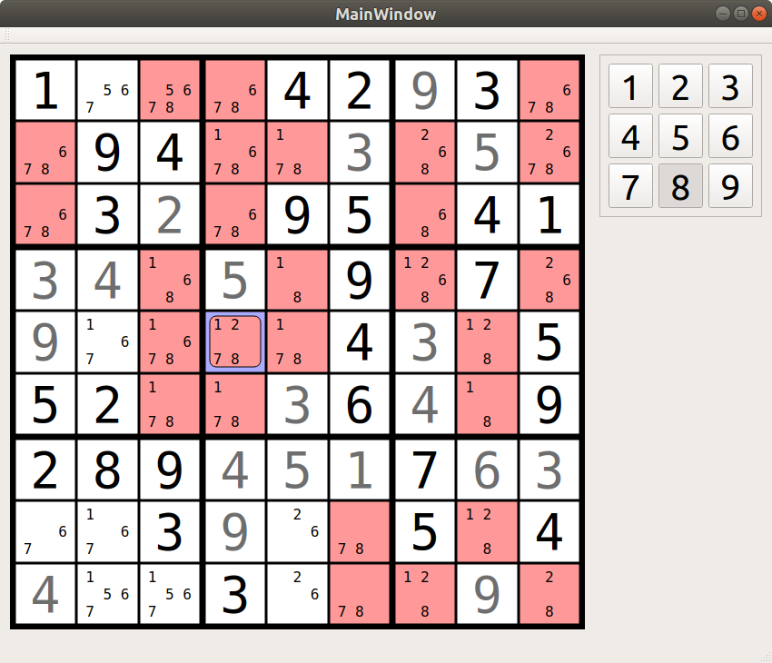

# Sudoku GUI
This is a Qt5 GUI that uses the Rust sudoku library for all of its game logic. It serves as a testbed for the further development of the APIs around the sudoku solver that's using human strategies. The goal is to have a library that offers all the functionality to solve, generate and grade sudokus as well as give hints or full solution paths.

# Build
You need to have a C++ build environment, cmake, Qt 5 and Rust installed.
I don't know what minimum versions are strictly required for the C++ environment,
but CMake >= 3.10, Qt >=5.9.5 and a C++20 capable compiler should work. Rust needs to be >=1.40.
The cmake file is set to require the first two.

Building should be just
```bash
$ cmake -B build
$ cmake --build build
```

But I can only say that it works for certain on Ubuntu 20.04 with all of the required Qt dependencies installed.

# Controls

| Action                    |       Are        |
| ------------------------- | :--------------: |
| Focus cell                |   Click on it    |
| Enter number              |      1 - 9       |
| Enter highlighted number  |      Enter       |
| Toggle pencil marks       |     F1 - F9      |
| Toggle highlighted mark   |      Space       |
| Select digit to highlight |    Alt + 1-9     |
| Move                      |    Arrow keys    |
| Give a hint               |        H         |
| Undo                      |     Ctrl + Z     |
| Redo                      | Ctrl + Shift + Z |


