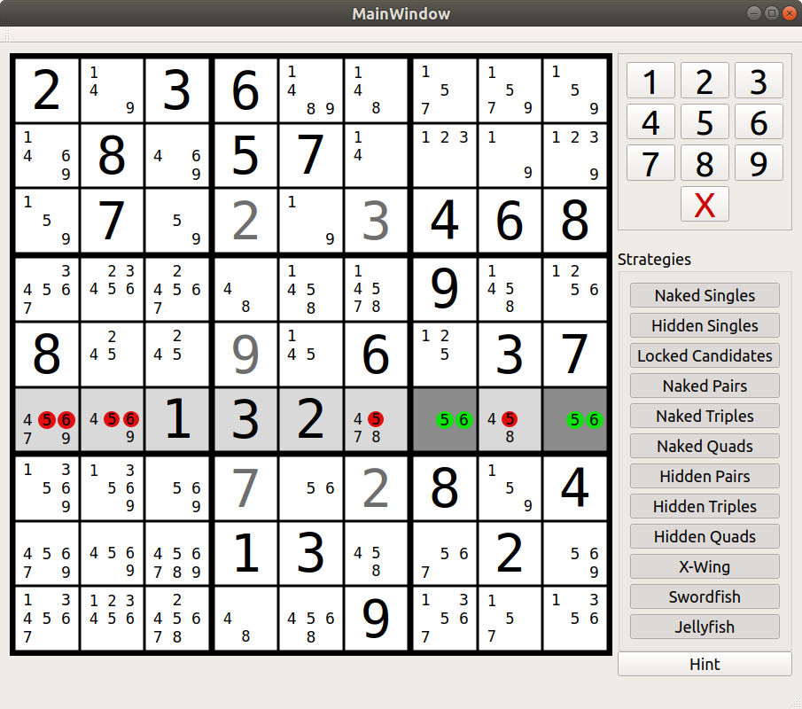

# Sudoku GUI
This is a Qt5 GUI that uses the Rust sudoku library for all of its game logic. It serves as a testbed for the further development of the APIs around the sudoku solver that's using human strategies. The goal is to have a library that offers all the functionality to solve, generate and grade sudokus as well as give hints or full solution paths.

# Build
You need to have a C++ build environment, cmake, Qt 5 and Rust installed.
I don't know what minimum versions are strictly required,
but CMake >= 3.10, Qt >=5.9.5 and Rust >= 1.29 should work.
The cmake file is set to require the former two.

Building should be just
```bash
$ cmake .
$ make
```

But I can only say that it works for certain on Ubuntu 18.04 with all of the required Qt dependencies installed.

# Controls

| Action                   |      Are      |
|--------------------------|:-------------:|
| Focus cell               | Click on it   |
| Enter number             | 1 - 9         |
| Toggle pencil marks      | F1 - F9       |
| Select highlighted digit | Alt + 1-9     |
| Undo                     | Ctrl + Z      |
| Move                     | Arrow keys    |

Redo is not currently implemented


